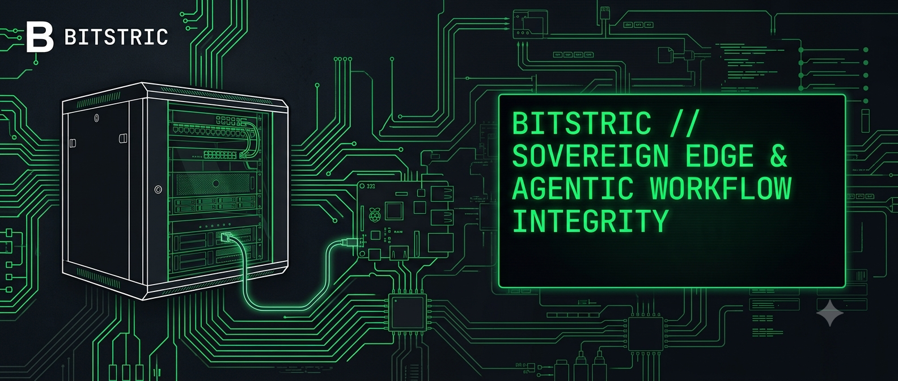

[Bitstric](https://bitstric.com) delivers asset-light Sovereign AI and Agentic Workflow architectures engineered explicitly for real-world workflow reliability. 

We deploy multi-lingual automated chat brokers, accelerated document ingestion pipelines, and inline pre-inference validation layers that bridge digital workloads into private infrastructure. Our framework eliminates the operational volatility and data residency leaks inherent in public cloud models.

We actively target high-consequence sectors—including Healthcare, Manufacturing, Robotics, FMCG, Utilities, and Finance—operating across complex regulatory corridors. 

Our open-core software utilities seamlessly guide enterprise clients into a structured commercial step-ladder. This process routes targets from upfront paid risk reviews directly into localized, sandbox-integrated edge system deployments.
